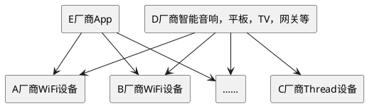
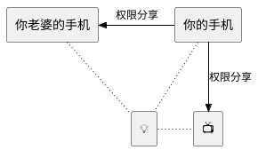

# 简介及准备工作

## 从Apple抢跑开始

工作的原因，大概从今年(2021）1月就开始关注Matter。各种原因一直只下载了一份规范文档在啃，直到6月份，Apple在WWDC上发布了这么一个视频，我感觉应该是时候深入了。

https://developer.apple.com/videos/play/wwdc2021/10298/

一句话说，就是Apple在HomeKit里计划用下图这样的方式实现Matter，并且计划在21.9月iOS15发布时，就抢跑发布。之所以说是抢跑，是因为彼时Matter的发布计划还是22年1月。当然现在这个计划以及延迟到明年4月了。后来也尝试过在iOS15上给Matter添加Matter的设备，确实是6月份的一个版本，基本能跑，因为和最新的版本差异较大，又不支持我们关注的放心，就没有深入。

从这张图及视频不难看出，对于用户及App开发者来说，在iOS上，Matter设备基本上与HomeKit设备一致，只是设备端会更灵活，一次认证，可以支持更多的控制端生态。

## 系列预告

## Matter是什么

在啃规范文档的时候，我就尝试过总结Matter到底是什么，说明白不难，但要说的图文并茂加生动活泼就是不是我擅长的了。所有这里也就不做过多的重复，推荐两篇公众号文章，一看就明白。

https://mp.weixin.qq.com/s/tG5GFEw7O8EzwmWdKQ8xCw

https://mp.weixin.qq.com/s/S3MKdsnDbHqlVjcPapbIDQ

当然如果一定要说三个我自己认为的最重要的东西，那我会选互联互通、本地网络和多生态同时控制。

### 互联互通

Matter要做的是互联互通，也就是上图中画的这样，无论你家的智能设备是ABC哪个厂家的，只要他们遵循Matter协议，他们都可以被DE等厂家同样遵循Matter协议的设备或者App来控制。

这和当前市面上流行的智能家居设备互联互通方式不同，当前市面上的设备互联互通方式主要要云云对接和一端多云，这些方式都是以厂商间的合作为前提的，AD两个厂家有合作，签了合同，做了定制开发，他们就可以通，否则就通不了。可以想象，这样的互通一定是一个个的信息孤岛，每个设备都是一个岛，这个岛与哪些岛相连，充满了神秘。

你在买手机的时候，从来不会考虑家里它能不能连进家里的路由器，但现在我们选购智能家居设备的时候，我们却不得不考虑我家的电视能不能和我家的门锁连接起来。于是大多数情况下，我们不得不干脆把全屋的设备绑死在一个厂家身上，并且起了一个高大上的名称——全屋智能。

而有了Matter，这个问题就可以解决了。Matter就大致相当于手机场景里的WiFi，只要设备上有了Matter这个标识，他们就肯定是可以连接的。

### 本地网络

Matter是纯本地网络的协议，跟HomeKit一样，他只定义本地局域网中的控制协议，不管主控端到云。这对于那些非常关注个人隐私的用户来说，是一个非常好的消息。当然不定义不表示不能做，你仍然可以通过家里的一台网关类设备作为代理，来实现远程的设备控制和查看，前提是你家里必须有一台适合做网关的设备，比如丢在沙发上的iPad，配电箱的路由器或者客订里的智能电视。

目前Matter支持WiFi网络、以太网以及Thread网络。

### 多生态同时控制

多生态同时控制说的是对于Matter的一个被控设备来说，可以同时被来自不同厂家的控制器控制，他们之间互不干涉。在Matter里这个特性叫做Multiple Fabric。（或者之前的版本叫做Multiple Admin，他们是同一个东西）

比如你用的是华为手机，把你家的灯加入手机的负一屏来控制显然是一个不错的选择，但如果你老婆用的是iPhone，你仍可以把这个灯分享给iOS的家庭应用，而且不需要华为跟Apple也合作关系。于此同时，你还可以把这个灯分享给家里的TCL电视，让它在享受家庭影院时，自动帮你把灯设置到最合适的亮度。

## 准备工作