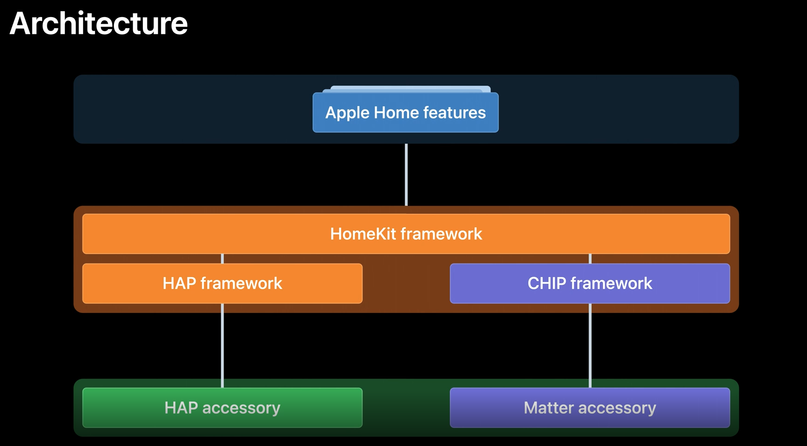

# Matter开发笔记简介

## 从Apple抢跑开始

工作的原因，大概从今年1月就开始关注Matter。各种原因一直只下载了一份规范文档在啃，直到6月份，Apple在WWDC上发布了这么一个视频，我感觉应该是时候深入了。

https://developer.apple.com/videos/play/wwdc2021/10298/

一句话说，就是Apple在HomeKit里计划用下图这样的方式实现Matter，并且计划在21年9月iOS15发布时，就抢跑发布。之所以说是抢跑，是因为彼时Matter的发布计划还是22年1月。当然现在这个计划已经延迟到了22年4月。后来我也尝试过在iOS15上添加Matter的设备，确实是6月份的一个版本，基本能跑，因为和最新的版本差异较大，又不支持我们关注的TV方向，就没有深入。

从视频里的这张图不难看出，对于用户及App开发者来说，在iOS上，Matter设备基本上与HomeKit设备是一致的，只是对设备来说会更灵活一些，一次认证，可以支持更多的控制端生态。当然这个过程中，HomeKit里会不会夹带Apple的私货，比如AirPlay2，以及Matter什么时候会跟进，这就是另外一个故事了。一般来说，标准是永远也追不上私有的，比如浏览器里曾经的一堆姓-webkit-的标签。

## 关于这个笔记

本来以为这个活儿跟之前的开源移植不会有什么区别，下个代码，编译一下，再集成到自己的系统中，跑通了就扔出去慢慢完善，同时看看核心代码提供一些支援。却没想到跑着跑着，慢慢就干起了开源，从最初提交一些辅助脚本，到改模块架构，再到被管理员误认为是模块的maintainer。加上随着跟同行沟通的增多，大家越来越多的公认这个事，确实是行业里的历史事件，遂萌生了一些把这个过程记录起来的想法。说起来，咱不又参与历史了呢。

基于上面的原因，这个系列的内容肯定就不是实时的了，文章上传的时候上面描述的一些情况几乎都不存在了(因为代码已经修复了)，但感谢github为我们详细记录了这个过程，我会尽量附上当时的commitid，供后续参考。

## Matter是什么

在啃规范文档的时候，我就尝试过总结Matter到底是什么，说明白不难，但要说的图文并茂加生动活泼就是不是我擅长的了。所有这里也就不做过多的重复，推荐两篇公众号文章，一看就明白。

https://mp.weixin.qq.com/s/tG5GFEw7O8EzwmWdKQ8xCw

https://mp.weixin.qq.com/s/S3MKdsnDbHqlVjcPapbIDQ

当然如果一定要说三个我自己认为的最重要的东西，那我会选互联互通、本地网络和多生态同时控制。

### 互联互通

Matter要做的是互联互通，也就是下图中画的这样，无论你家的智能设备是ABC哪个厂家的，只要他们遵循Matter协议，他们都可以被DE等厂家同样遵循Matter协议的设备或者App来控制。（注：硬件限制显然仍是不可逾越的，比如上图中App就没有跟Thread设备的连线，因为当前手机普遍不支持Thread网络）

这和当前市面上流行的智能家居设备互联互通方式不同，当前市面上的设备互联互通的方式主要是云云对接和一端多云，这些方式都是以厂商间的合作为前提的，AD两个厂家有合作，签了合同，做了或多或少的定制开发，他们就可以通，否则就通不了。可以想象，这样的互通一定是一个个的信息孤岛，每个设备都是一个岛，这个岛与哪些岛相连，充满了神秘。

我们在买手机的时候，从来不会考虑家里它能不能连进家里的路由器，但基于上面的原因，现在我们选购智能家居设备时，却是不得不考虑我家的电视能不能和我家的门锁连接起来。于是大多数情况下，我们不得不干脆把全屋的设备绑死在一个厂家身上，并且起了一个高大上的名称——全屋智能。

而有了Matter，这个问题就可以解决了。Matter就大致相当于手机场景里的WiFi，只要设备上有了Matter这个标识，他们就可以连接。

### 本地网络

Matter是纯本地网络的协议，跟HomeKit一样，他只定义本地局域网中的控制协议，不管主控端到云。这对于那些非常关注个人隐私的用户来说，是一个非常好的消息。

当然不定义不表示不能做，你仍然可以通过家里的一台网关类设备作为代理，来实现远程的设备控制和查看，前提是你家里必须有一台适合做网关的设备，比如丢在沙发上的iPad，配电箱的路由器或者客厅里的智能电视。

目前Matter支持WiFi网络、以太网以及Thread网络。

### 多生态同时控制

多生态同时控制说的是对于Matter的一个被控设备来说，可以同时被来自不同厂家的控制器控制，他们之间互不干涉。在Matter里这个特性叫做Multiple Fabric。（或者之前的版本叫做Multiple Admin，他们是同一个东西）

比如你用的是华为手机，把你家的灯加入手机的负一屏来控制显然是一个不错的选择，但如果你老婆用的是iPhone，你仍可以把这个灯分享给iOS的家庭应用，而且不需要华为跟Apple也合作关系。于此同时，你还可以把这个灯分享给家里的TCL电视，让它在享受家庭影院时，自动帮你把灯设置到最合适的亮度。

## 准备工作

为了进行Matter开发，下面的这些资料对你来说应该会有帮助：

1. SDK GitHub
    - https://github.com/project-chip/connectedhomeip
    - 由于Matter目前仍在开发过程中，相关的资料并不公开，所以如果你所在的组织还不是CSA的成员，那么这个暂时可能是你唯一可以获取的内容
2. CSA工作组
    - 地址就不提供了，如果你所在的组织已经加入了CSA，发邮件给CSA联系人就可以获取地址和账号
    - 这里名义上是官方的工作区，会发布最新的各种资料，但实际上个人感觉这里并不热闹。最重要的作用就是通知每天的各种会议及发布纪要。前提是你能够每天半夜起来开会，还有有练听力的决心。
3. Specifications GitHub
    - 私有项目同样就不贴地址了，CSA成员同样发邮件给CSA联系人申请
    - 这里是最新的Matter规范文档的撰写区，可以下载最及时的规范文档，当然也可以提Issue和PR，都会有人处理。只不过Issue区应该只能处理文字上的问题，如果想要就方案和需求提案，还是要上CSA工作组。
4. Test Plans GitHub
    - 同样私有项目，同样不贴地址了，同样CSA成员同样发邮件给CSA联系人申请
    - 测试用例及测试工具的开发区，最新的测试用例，测试工具都可以在这里找到。
5. Slack 工作区
    - 同样私有，同样没有地址，同样CSA成员同样发邮件给CSA联系人申请
    - 应该是最热闹的地方了，任何相关的问题，都可以在这里问，包括找人走读你的PR，会有人答复你的。
6. CMGC(CSA中国成员组)
    - https://zigbeealliance.org/about/cmgc/
    - CSA下属的中国成员组，会定期帮忙汇总Matter的各种资料，提醒Matter重要事件及会议，以及组织相关国内的讨论。前面的两篇公众号，就是出自他们。只不过加入CSA后再加入他们还需要额外的费用，好在不贵，而且非常值得。

开发环境方面，由于我主要在做Android TV这一块的，目前看来：
- MacOS是最方便的，升级到11.6.1都没有问题，M1芯片也没有什么大问题，可以放心入手。
- Ubuntu 20.04 LTS也是可以，但是要用带GUI的，因为要跑Android Studio。
- Ubuntu Server或者WSL + Windows上跑Android Studio理论上也是可以的，但我在同事的机器上调试没有成功(已设置target.source-map)，时间关系，这个坑就先挖这里了。
- 如果你还想跑蓝牙配网等相关的流程，那么开发板还是要要一块的，ESP32 (M5 stack)之类的。但是本着通用性的考虑和与我的开发环境（MacOS）的契合度的问题，我自己选的是树莓派4，毕竟后面用来~~吃灰~~跑一些软路由、云服务什么的，还是蛮香的。
    - ESP32其实也支持MacOS的开发环境，详细见[这里](https://docs.espressif.com/projects/esp-idf/zh_CN/latest/esp32/get-started/index.html)
